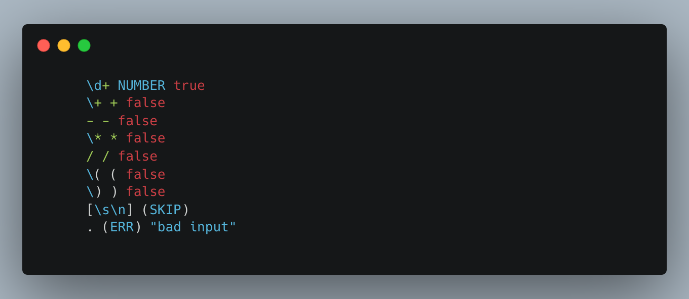
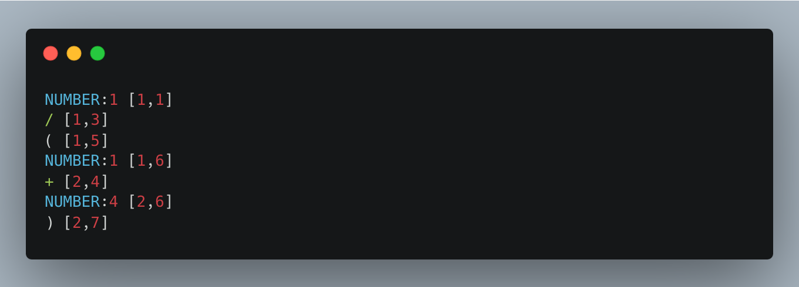
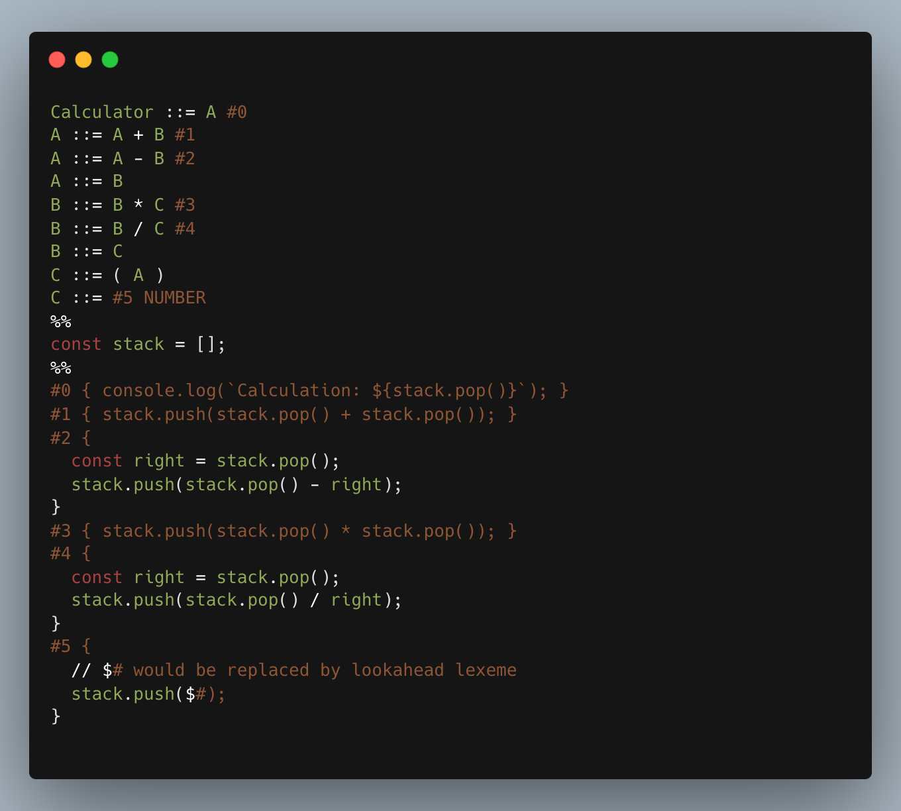
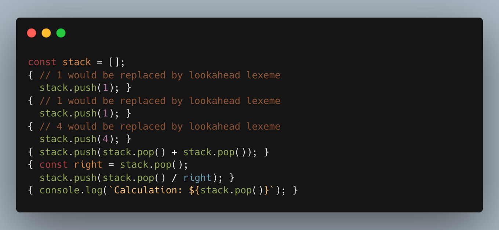

# leto

This is a two part project that allows to create a lexer and a parser
(with syntax directed translation) for an arbitrary
[LL(1)](https://en.wikipedia.org/wiki/LL_grammar) programming language.

You might also be interested in [Alia](https://github.com/maxpatiiuk/alia) -
a compiler and interpreter for my programming language.

## Prerequisites

- Node 18
- NPM 8

## Installation

Install dependencies:

```shell
npm install
```

## Lexer

Lexer is a Scanner-Generator. It's syntax is based on that of
[Flex](https://www.cs.princeton.edu/~appel/modern/c/software/flex/flex.html).

Example spec is provided in [`./fixtures/lexer.spec`](./fixtures/lexer.spec):



Spec file consists of list of rules. Each rule begins with a regular expression.

Second part could be one of:

- `(SKIP)` - throws out matching text.
- `(ERR)` - emits an error. Error will include token position. An error
  message can be provided as a third argument.
- any other string - will be used as a token type. In this case, the third part
  of the rule is a boolean indicating whether this token type should capture
  the matched characters (useful for identifiers and literals).

## Running Lexer

To see available options, run the script with the `--help` argument:

```shell
./lexer --help
```

Example call:

```shell
./lexer --spec ./fixtures/lexer.spec --input ./fixtures/in.leto --output ./fixtures/out.tokens
```

Where, `./fixtures/in.leto` is:

```
1 / (1
   + 4)
```

This is how resulting token steam looks like (outputted in `./fixtures/out.tokens`):



## Parser & Syntax-Directed Translator

Syntax-directed translator-generator written in TypeScript.

Implements an [LL(1)](https://en.wikipedia.org/wiki/LL_grammar) parser.

### Running Parser

To see available options, run the script with the `--help` argument:

```shell
./parser --help
```

Example call (using `fixtures/out.tokens` generated by lexer in the previous step):

```shell
./parser --grammar ./fixtures/parser.spec --tokens ./fixtures/out.tokens --executable fixtures/executable.js
```

Where `./fixtures/parser.spec` contains the grammar and syntax-directed
translation rules:



The file is split into 3 sections (using `%%` as a separator):

- First section defines a grammar and calls to syntax-directed translation
  functions.
- Second section allow to initialize the environment for the syntax-directed
  translation (i.e, allocate a stack, define helper functions). Any JavaScript
  code can be put in here.
- Third section defines syntax-directed translation functions. Each definition
  has it's own local scope in which you can write JavaScript.

Running the parser will generate JavaScript file that, when executed, will print
the result of the syntax-directed translation:



```shell
node ./fixtures/executable.js
```

Output:

```
Calculation: 0.2
```

## Compiler and Interpreter

You might also be interested in [Alia](https://github.com/maxpatiiuk/alia) -
a compiler and interpreter for my programming language.

## Unit Tests

Jest is used for unit testing.

You can run it like this:

```shell
npm test
```

## Naming

Project name comes from Leto Atreides II from the Dune science fiction series.